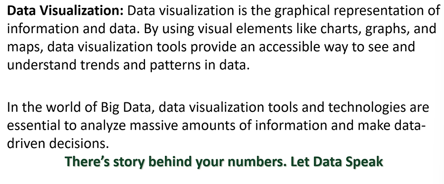
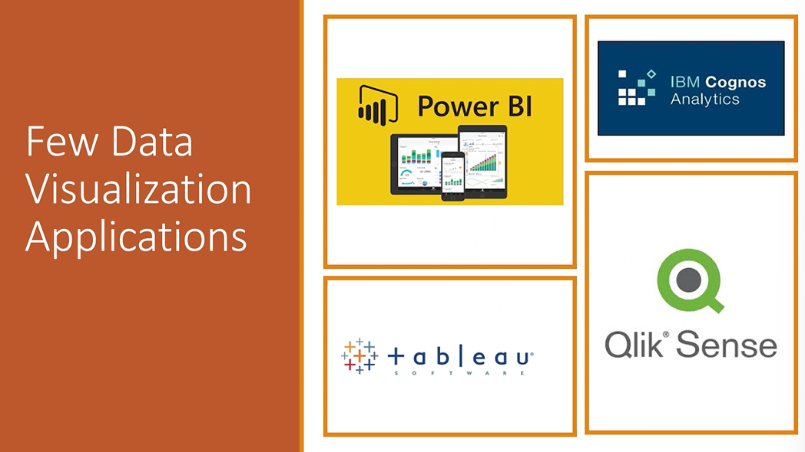
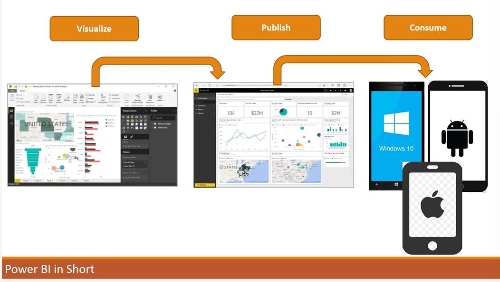
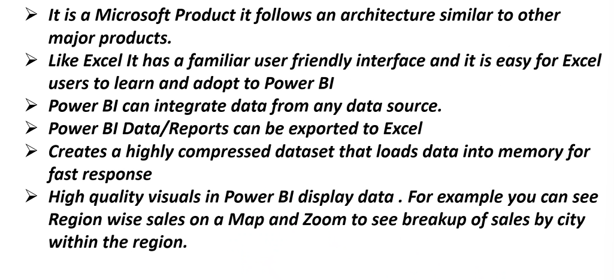
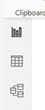
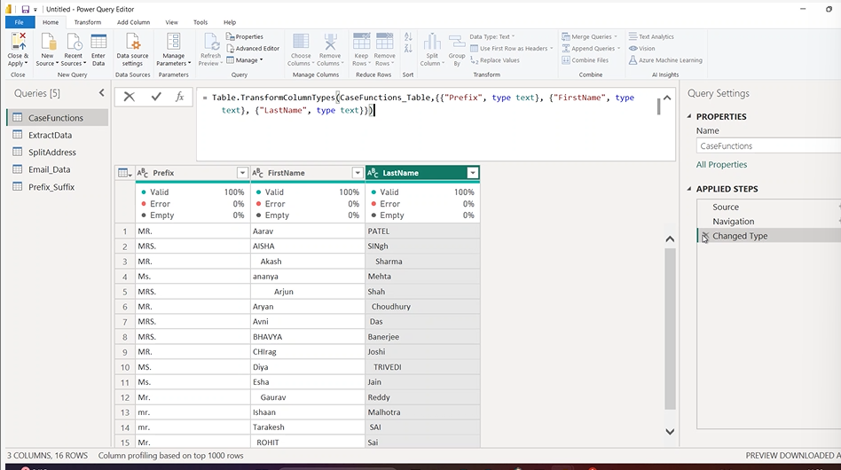
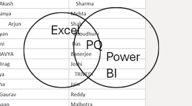
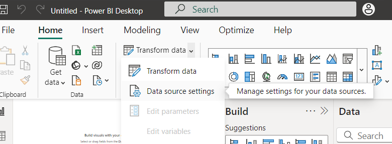
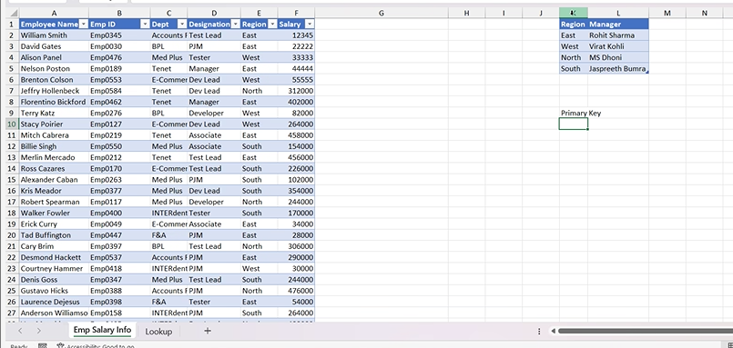

## Power BI

- 
- 

> steps in powerBI

1. Collect the data
2. transformation of data(adding or removing data) or cleaning[Power Query in excel]
3. combining of data / data modelling (creating relationships)[Power pivot in excel]
4. vizualization of data
5. Publish

> `Power BI service` -> to share the vizualized data/reports

- 
- 

> versions of power BI(BI -> bussiness intelligence)

- Power BI Desktop
- Power BI Pro
- Power BI Premium
- Power BI Mobile
- Power BI Embedded (used when power bi is integrated with other software)
- Power BI Report server

> 3 types of views

1. report view
2. table view
3. model view

- 

> power query uses `M language(Mashup language)`

- 
- power query -> ETL Tool (Extract Transformation Load)
- 

> data source settings -> used to change the source file destination when the file loaction is changed (to resolve the errors realted to path of source file)

- 

> Lookup Table vs Transaction Table

- 

- Lookup Table

  - small in size
  - they have one column with all unique values
  - each unique value is called as PRIMARY KEY
  - no duplicates in that column
  - usually meant for description of data

- Transaction Table
  - Big in size
  - no columns with unique values
  - there will be a column which are similar to primary key called as FOREIGN KEY
  - Duplicates will be there
  - usually meant for calculations
