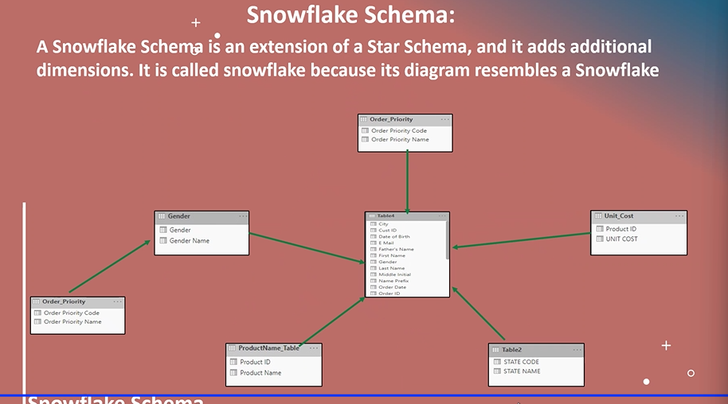

> wide table and tall table

- 
- power BI understands tall table format
- process of changing wide table to tall table -> `unpivoting`

## Data Modelling

- 
- 
- 
- 
- 
- 
- 
- 
- 

## DAX (Data Analysis Expressions)

- 
- 
- 
- 
- Backend -> uses `M Language`
- frontend -> uses `DAX`
- 
- 
- 
- 
- 

> DAX Functions

- 

> format (DAX Function)options

- 

> Date Tables

- 3 ways to create
  1. 
  2. 
