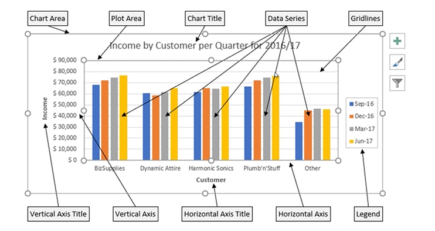
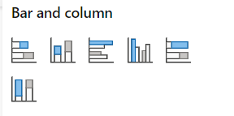
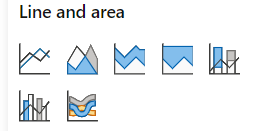
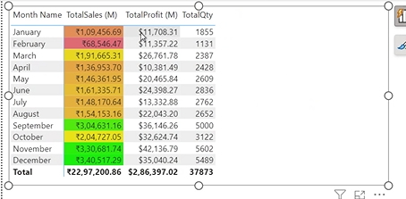
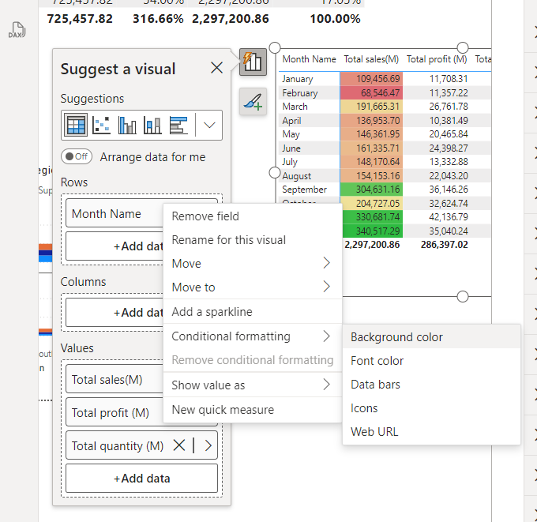
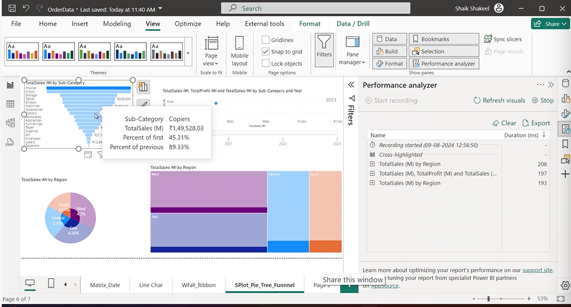
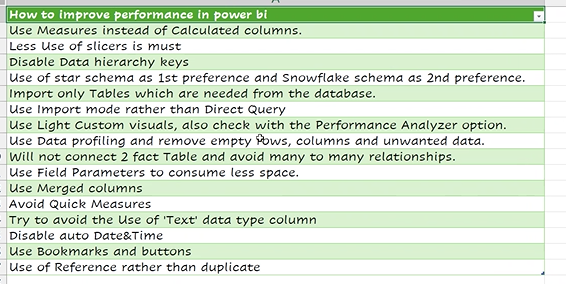

> chart elements

- 

> comparison charts

- 

> comparison charts with date and time scenarios

- 

> conditional formating

- 
- 

> financial statement analysis charts

- 

> Tree Map -> used when hirerchial data to be shown

> Performance Analyzer

- 

> performance optimization tips

- 
